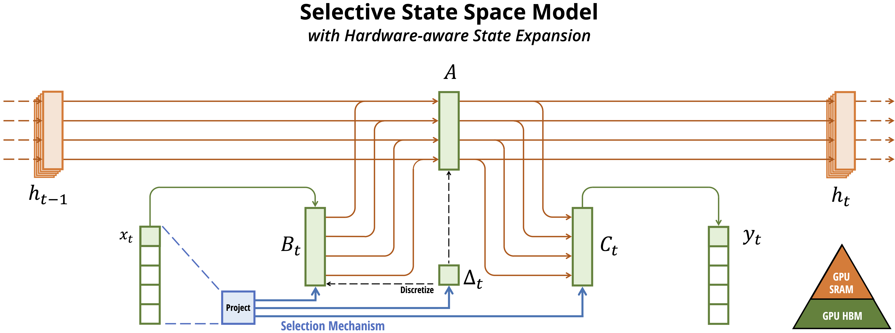
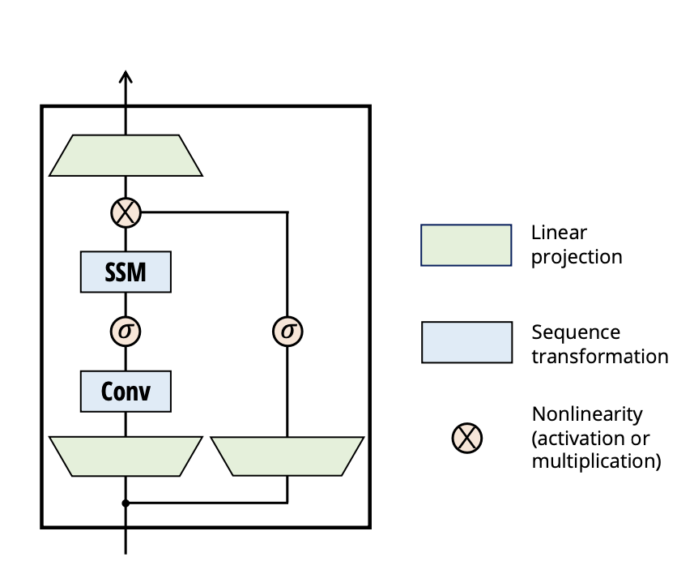

# baby_mamba
An implementation of Mamba to develop an understanding of its functioning.

### Intro:
Mamba is a recent sequence modelling architecture proposed by Albert Gu and Tri Dao (https://arxiv.org/abs/2312.00752). Mamba selling points are fast inference (5x faster than transformers) and linear scaling with sequence length. 

Mamba main building block is a computation of the following equations (State Space Model):


`h(t + 1) = Ah(t) + Bx(t)`  (1)

`y(t) = Ch(t) + Dx(t)`  (2)


For discrete modalities such as texts and genomics, A and B will be discretised by a timestep ∆.
 
Mamba proposed computing an input-dependent version of the preceding equations by making ∆, B, and C functions of the input. This ensures a selection mechanism over the input, similar to the attention mechanism in transformers.

**Interpretation of ∆:**
- *Function:* ∆ controls the balance between focusing on or ignoring the current input $(x_t)$.
- *Effect:* A large ∆ resets the state $(h)$ and emphasises the current input, while a small ∆ maintains the state, effectively ignoring the current input.
- *Relation to SSMs:* Equations (1)-(2) can be seen as a continuous system discretised by a timestep ∆. A large ∆ represents the system focusing on the current input for an extended duration, while a small ∆ signifies a transient input that is ignored. The selectivity in ∆ is crucial to ensure selectivity in (A, B), and it serves as the primary source of improvement.

**Interpretation of A:**
- *Role:* A parameter interacts with ∆ through $A = \exp(\Delta A)$ (discretisation equation).
- *hypothesis (Mamba paper page 9):* Making A selective in addition to or instead of ∆ could yield similar performance, but for simplicity, it is left out.

**Interpretation of B and C:**
- *Role of B and C:* Modifying B and C to be selective provides finer control over incorporating input $(x_t)$ into the state $(h_t)$ or the state into the output $(y_t)$.
- *Interpretation:* B and C enable the model to modulate recurrent dynamics based on content (input) and context (hidden states), respectively.

This computation (i.e SSM block) is implemented in *selective_scan.py* (it's the reference implementation from [mamba code base](https://github.com/state-spaces/mamba/), and it's not the hardware-aware implementation, check: https://github.com/state-spaces/mamba/tree/main/mamba_ssm/ops for more info)

The Figure (from mamba paper) below describes the interaction of these equations:



Just like other mainstream architectures, Mamba interleaves this computation (SSM block) with MLP layers, a normalisation technique and a residual connections, they have also added a conv layer (Figure-from mamba paper-below):

<p align="center">
    
</p>


### run code:

##### Environment:
```
conda env create -f environment.yml
conda activate mamba_env
```
##### Train a Mamba
The 'config.ini' file includes model configurations and training arguments. You are free to define any model size; however, note that this implementation does not follow the hardware-friendly selective-span approach. Once you have configured the model size, and training argurments, proceed to run the training using the following command:
```
python main.py -c config.ini
```

